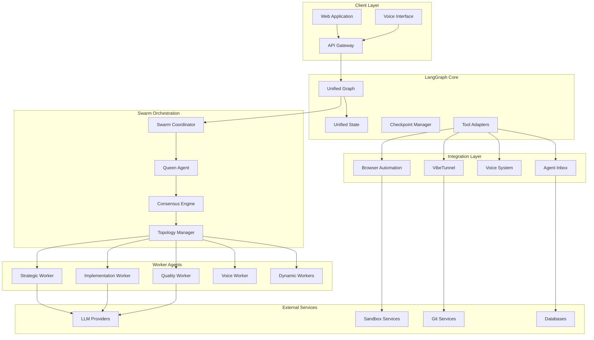

****# Design Document

## Overview

The LangGraph Swarm Migration transforms Solomon Codes from a traditional multi-agent architecture into a unified, swarm-based system powered by LangGraph. This design introduces a Queen AI with dynamic worker agents, implementing Test-Driven Development (TDD) London School methodology and unifying all existing features into a single, scalable architecture.

The migration preserves all existing functionality while adding advanced swarm coordination, consensus mechanisms, and dynamic topology management. The system will support multiple interaction modalities including voice, browser automation, and traditional chat interfaces.

## Architecture

### High-Level Architecture



### Core Components

#### 1. LangGraph Foundation

**Unified Graph Engine**
- Single LangGraph instance managing all agent interactions
- State transitions for all agent communications
- Checkpoint management for persistence and recovery
- Tool integration for external service access

**Unified State Management**
- Combined state schema incorporating all existing agent states
- Immutable state updates with proper versioning
- Cross-agent state synchronization
- Memory management with namespace isolation

#### 2. Swarm Orchestration Layer

**Queen Agent**
- Central decision-making authority
- Task analysis and agent allocation
- Strategic oversight and coordination
- Decision recording and audit trail

**Swarm Coordinator**
- Agent lifecycle management
- Resource allocation and limits
- Task distribution and load balancing
- Failure detection and recovery

**Consensus Engine**
- Byzantine fault-tolerant voting
- Decision aggregation algorithms
- Conflict resolution mechanisms
- Audit trail for all decisions

**Topology Manager**
- Dynamic topology switching (hierarchical, mesh, ring, star)
- Performance-based topology optimization
- Agent communication routing
- Network partition handling

#### 3. Worker Agent Architecture

**Base Worker Interface**
```typescript
interface BaseWorker {
  id: string;
  type: WorkerType;
  capabilities: string[];
  status: WorkerStatus;
  
  execute(task: Task): Promise<TaskResult>;
  terminate(): Promise<void>;
  getMetrics(): WorkerMetrics;
}
```

**Specialized Workers**
- **Strategic Worker** (formerly Planner): High-level planning and architecture
- **Implementation Worker** (formerly Programmer): Code generation and modification
- **Quality Worker** (formerly Reviewer): Code review and quality assurance
- **Voice Worker**: Voice interaction and processing
- **Dynamic Workers**: Spawned based on specific task requirements

## Components and Interfaces

### 1. Swarm Coordinator

```typescript
export class SwarmCoordinator {
  private queenAgent: QueenAgentCapabilities;
  private consensusEngine: ConsensusEngineCapabilities;
  private topologyManager: TopologyManagerCapabilities;
  private activeWorkers: Map<string, WorkerInstance>;
  private maxAgents: number;

  async spawnAgentsForTask(task: Task): Promise<WorkerInstance[]>;
  async buildConsensus(decision: Decision): Promise<ConsensusResult>;
  async optimizeTopologyForTask(task: Task): Promise<void>;
  async handleAgentFailure(agentId: string, error: Error): Promise<void>;
  getActiveAgentCount(): number;
  getState(): Partial<HiveMindState>;
}
```

### 2. Queen Agent Interface

```typescript
interface QueenAgentCapabilities {
  register(config: AgentConfig): void;
  analyzeTask(task: Task): Promise<TaskAnalysis>;
  recordDecision(decision: DecisionRecord): void;
  recordFailure(agentId: string, error: Error): void;
  getStrategicOverview(): StrategicOverview;
}
```

### 3. Consensus Engine

```typescript
interface ConsensusEngineCapabilities {
  collectVotes(decision: Decision): Promise<Vote[]>;
  calculateConsensus(votes: Vote[]): ConsensusResult;
  handleByzantineFailure(failedNodes: string[]): void;
  getConsensusHistory(): ConsensusRecord[];
}
```

### 4. Topology Manager

```typescript
interface TopologyManagerCapabilities {
  getCurrentTopology(): SwarmTopology;
  setTopology(topology: SwarmTopology): void;
  switchTopology(topology: SwarmTopology): Promise<void>;
  recommendTopology(task: Task): SwarmTopology;
  optimizeConnections(): Promise<void>;
}
```

### 5. Agent Migration Interfaces

**Strategic Worker (Planner Migration)**
```typescript
export class StrategicWorker extends BaseWorker {
  constructor(config: WorkerConfig);
  async createPlan(requirements: Requirements): Promise<Plan>;
  async optimizePlan(plan: Plan, constraints: Constraints): Promise<Plan>;
  async validatePlan(plan: Plan): Promise<ValidationResult>;
}
```

**Implementation Worker (Programmer Migration)**
```typescript
export class ImplementationWorker extends BaseWorker {
  constructor(config: WorkerConfig);
  async generateCode(specification: CodeSpec): Promise<CodeResult>;
  async refactorCode(code: string, requirements: RefactorSpec): Promise<CodeResult>;
  async debugCode(code: string, error: Error): Promise<DebugResult>;
}
```

**Quality Worker (Reviewer Migration)**
```typescript
export class QualityWorker extends BaseWorker {
  constructor(config: WorkerConfig);
  async reviewCode(code: string, standards: QualityStandards): Promise<ReviewResult>;
  async runTests(testSuite: TestSuite): Promise<TestResult>;
  async generateTests(code: string): Promise<TestSuite>;
}
```

### 6. Integration Layer Interfaces

**VibeTunnel Integration**
```typescript
interface VibeTunnelIntegration {
  createTerminalSession(config: TerminalConfig): Promise<TerminalSession>;
  executeCommand(sessionId: string, command: string): Promise<CommandResult>;
  getSessionStatus(sessionId: string): Promise<SessionStatus>;
  closeSession(sessionId: string): Promise<void>;
}
```

**Agent Inbox**
```typescript
interface AgentInbox {
  sendMessage(message: AgentMessage): Promise<MessageId>;
  receiveMessages(agentId: string): Promise<AgentMessage[]>;
  routeMessage(message: AgentMessage): Promise<RoutingResult>;
  handleDeadLetter(message: AgentMessage): Promise<void>;
}
```

**Voice System Integration**
```typescript
interface VoiceSystemIntegration {
  processAudioInput(audio: AudioBuffer): Promise<TranscriptionResult>;
  synthesizeSpeech(text: string, voice: VoiceConfig): Promise<AudioBuffer>;
  routeVoiceCommand(command: VoiceCommand): Promise<CommandResult>;
  getLettaMemory(sessionId: string): Promise<LettaMemory>;
}
```

## Data Models

### 1. Unified State Schema

```typescript
export const UnifiedStateSchema = z.object({
  // Core agent states (existing)
  manager: ManagerStateSchema,
  planner: PlannerStateSchema,
  programmer: ProgrammerStateSchema,
  reviewer: ReviewerStateSchema,
  
  // New swarm states
  hiveMind: HiveMindStateSchema,
  swarmCoordination: SwarmCoordinationStateSchema,
  consensus: ConsensusStateSchema,
  topology: TopologyStateSchema,
  
  // Integration states
  voice: VoiceStateSchema,
  vibeTunnel: VibeTunnelStateSchema,
  agentInbox: AgentInboxStateSchema,
  
  // Global metadata
  sessionId: z.string(),
  startTime: z.string(),
  lastActivity: z.string(),
  version: z.string().default("2.0.0"),
});
```

### 2. Swarm-Specific Models

```typescript
export const SwarmCoordinationStateSchema = z.object({
  activeWorkers: z.map(z.string(), z.custom<WorkerInstance>()),
  taskQueue: z.array(TaskSchema),
  resourceAllocation: z.record(z.string(), ResourceAllocationSchema),
  topology: z.enum(["hierarchical", "mesh", "ring", "star"]),
  maxAgents: z.number().default(8),
});

export const ConsensusStateSchema = z.object({
  activeDecisions: z.array(DecisionSchema),
  voteHistory: z.array(VoteRecordSchema),
  consensusResults: z.array(ConsensusResultSchema),
  byzantineFailures: z.array(z.string()),
});

export const TopologyStateSchema = z.object({
  currentTopology: z.enum(["hierarchical", "mesh", "ring", "star"]),
  connections: z.array(ConnectionSchema),
  performanceMetrics: z.record(z.string(), z.number()),
  optimizationHistory: z.array(OptimizationRecordSchema),
});
```

### 3. Task and Decision Models

```typescript
export const TaskSchema = z.object({
  id: z.string(),
  description: z.string(),
  priority: z.enum(["low", "medium", "high", "critical"]),
  requiredCapabilities: z.array(z.string()),
  complexity: z.enum(["simple", "medium", "complex"]),
  parallelizable: z.boolean().default(false),
  dependencies: z.array(z.string()).default([]),
  assignedWorkers: z.array(z.string()).default([]),
  status: z.enum(["pending", "in_progress", "completed", "failed"]),
  createdAt: z.string(),
  updatedAt: z.string(),
});

export const DecisionSchema = z.object({
  id: z.string(),
  type: z.string(),
  proposal: z.string(),
  severity: z.enum(["low", "medium", "high", "critical"]),
  requiredVotes: z.number(),
  deadline: z.string().optional(),
  context: z.any().optional(),
});
```

## Error Handling

### 1. Hierarchical Error Management

**Error Categories**
- **System Errors**: Infrastructure failures, network issues
- **Agent Errors**: Individual agent failures, timeout errors
- **Consensus Errors**: Voting failures, Byzantine faults
- **Integration Errors**: External service failures, API errors

**Error Handling Strategy**
```typescript
export class ErrorHandler {
  async handleSystemError(error: SystemError): Promise<RecoveryAction>;
  async handleAgentError(agentId: string, error: AgentError): Promise<RecoveryAction>;
  async handleConsensusError(decision: Decision, error: ConsensusError): Promise<RecoveryAction>;
  async handleIntegrationError(service: string, error: IntegrationError): Promise<RecoveryAction>;
}
```

### 2. Self-Healing Mechanisms

**Agent Recovery**
- Automatic agent respawning on failure
- State restoration from checkpoints
- Graceful degradation with reduced capabilities

**Consensus Recovery**
- Byzantine fault tolerance with 2f+1 nodes
- Automatic exclusion of failed nodes
- Consensus timeout and retry mechanisms

**Network Partition Handling**
- Topology adaptation during partitions
- Message queuing and replay
- Partition detection and healing

### 3. Circuit Breaker Pattern

```typescript
export class CircuitBreaker {
  private state: 'closed' | 'open' | 'half-open' = 'closed';
  private failureCount = 0;
  private lastFailureTime?: Date;
  
  async execute<T>(operation: () => Promise<T>): Promise<T>;
  private shouldAttemptReset(): boolean;
  private recordSuccess(): void;
  private recordFailure(): void;
}
```

## Testing Strategy

### 1. TDD London School Implementation

**Test Structure**
```typescript
describe('SwarmCoordinator', () => {
  let coordinator: SwarmCoordinator;
  let testDoubles: SwarmTestDoubles;
  
  beforeEach(() => {
    testDoubles = createSwarmTestDoubles();
    coordinator = new SwarmCoordinator({
      queenAgent: testDoubles.queenAgent,
      consensusEngine: testDoubles.consensusEngine,
      topologyManager: testDoubles.topologyManager,
      workerAgent: testDoubles.workerAgent,
    });
  });
  
  afterEach(async () => {
    await coordinator.shutdown();
  });
  
  describe('spawnAgentsForTask', () => {
    it('should spawn appropriate agents based on task analysis', async () => {
      // Given
      const task = createTestTask({ complexity: 'medium' });
      testDoubles.queenAgent.givenTaskAnalysis({
        agentCount: 2,
        agentTypes: ['programmer', 'tester']
      });
      
      // When
      const agents = await coordinator.spawnAgentsForTask(task);
      
      // Then
      expect(agents).toHaveLength(2);
      testDoubles.workerAgent.assertSpawnedWithTypes(['programmer', 'tester']);
    });
  });
});
```

**Test Doubles Architecture**
```typescript
export interface SwarmTestDoubles {
  queenAgent: MockQueenAgent;
  consensusEngine: MockConsensusEngine;
  topologyManager: MockTopologyManager;
  workerAgent: MockWorkerAgent;
}

export function createSwarmTestDoubles(): SwarmTestDoubles {
  return {
    queenAgent: new MockQueenAgent(),
    consensusEngine: new MockConsensusEngine(),
    topologyManager: new MockTopologyManager(),
    workerAgent: new MockWorkerAgent(),
  };
}
```

### 2. Test Coverage Requirements

**Coverage Targets**
- Branches: 80%+
- Functions: 80%+
- Lines: 80%+
- Statements: 80%+

**Test Categories**
- **Unit Tests**: Individual component testing with mocks
- **Integration Tests**: Component interaction testing
- **End-to-End Tests**: Full workflow testing
- **Performance Tests**: Load and scalability testing
- **Chaos Tests**: Failure scenario testing

### 3. Continuous Testing Pipeline

```typescript
export class TestPipeline {
  async runUnitTests(): Promise<TestResult>;
  async runIntegrationTests(): Promise<TestResult>;
  async runE2ETests(): Promise<TestResult>;
  async runPerformanceTests(): Promise<PerformanceResult>;
  async runChaosTests(): Promise<ChaosTestResult>;
  async generateCoverageReport(): Promise<CoverageReport>;
}
```

## Performance Considerations

### 1. Scalability Design

**Horizontal Scaling**
- Dynamic worker spawning based on load
- Load balancing across worker instances
- Resource pooling and sharing

**Vertical Scaling**
- Memory-efficient state management
- CPU optimization for consensus algorithms
- I/O optimization for external integrations

### 2. Caching Strategy

**Multi-Level Caching**
```typescript
export class CacheManager {
  private l1Cache: Map<string, any>; // In-memory
  private l2Cache: RedisCache; // Distributed
  private l3Cache: DatabaseCache; // Persistent
  
  async get<T>(key: string): Promise<T | null>;
  async set<T>(key: string, value: T, ttl?: number): Promise<void>;
  async invalidate(pattern: string): Promise<void>;
}
```

**Cache Invalidation**
- Event-driven cache invalidation
- TTL-based expiration
- Manual cache clearing for critical updates

### 3. Resource Management

**Memory Management**
- Garbage collection optimization
- Memory leak detection
- Resource pooling for expensive objects

**CPU Optimization**
- Async/await optimization
- Worker thread utilization
- Algorithm complexity optimization

## Security Considerations

### 1. Agent Authentication

**Identity Management**
```typescript
export class AgentIdentityManager {
  async authenticateAgent(agentId: string, credentials: AgentCredentials): Promise<AuthResult>;
  async authorizeAction(agentId: string, action: string, resource: string): Promise<boolean>;
  async revokeAccess(agentId: string): Promise<void>;
}
```

### 2. Secure Communication

**Message Encryption**
- End-to-end encryption for sensitive data
- Message signing for integrity verification
- Secure key exchange protocols

**Network Security**
- TLS/SSL for all external communications
- VPN support for distributed deployments
- Rate limiting and DDoS protection

### 3. Audit and Compliance

**Audit Trail**
```typescript
export class AuditLogger {
  async logAgentAction(agentId: string, action: string, context: any): Promise<void>;
  async logDecision(decision: Decision, result: ConsensusResult): Promise<void>;
  async logSecurityEvent(event: SecurityEvent): Promise<void>;
  async generateAuditReport(timeRange: TimeRange): Promise<AuditReport>;
}
```

## Migration Strategy

### 1. Phased Migration Approach

**Phase 1: Foundation (Weeks 1-2)**
- Complete LangGraph core setup
- Implement unified state management
- Set up testing infrastructure
- Create base worker interfaces

**Phase 2: Agent Migration (Weeks 3-4)**
- Migrate Manager → Queen Agent
- Migrate Planner → Strategic Worker
- Migrate Programmer → Implementation Worker
- Migrate Reviewer → Quality Worker

**Phase 3: Integration (Weeks 5-6)**
- Implement VibeTunnel integration
- Set up Agent Inbox system
- Integrate voice system
- Connect external services

**Phase 4: Optimization (Weeks 7-8)**
- Performance tuning and optimization
- Load testing and scalability validation
- Documentation and training
- Production deployment preparation

### 2. Backward Compatibility

**Legacy Support**
- Adapter pattern for existing APIs
- Gradual feature migration
- Fallback mechanisms for critical functions

**Data Migration**
- State schema versioning
- Automatic data transformation
- Rollback capabilities

### 3. Risk Mitigation

**Technical Risks**
- Comprehensive testing at each phase
- Feature flags for gradual rollout
- Monitoring and alerting systems

**Operational Risks**
- Detailed rollback procedures
- Staff training and documentation
- Staged deployment approach

This design provides a comprehensive blueprint for migrating Solomon Codes to a unified LangGraph-based swarm architecture while preserving all existing functionality and adding advanced coordination capabilities.